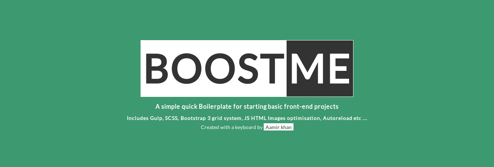

# BoostMe
## A simple quick Boilerplate for starting front-end projects
**Includes Gulp, SCSS, Bootstrap 3 grid system, JS HTML Images optimisation, Autoreload etc ...**



```bash
git clone https://github.com/iamaamir/boostme.git
cd boostme
npm install
```
to run the code just run `gulp`


```bash
root@Aamir:~/projects/boostme$ gulp
[23:30:41] Using gulpfile ~/projects/boostme/gulpfile.js
[23:30:41] Starting 'serve'...
[23:30:41] Finished 'serve' after 47 ms
[23:30:41] Starting 'watch'...
[23:30:41] Finished 'watch' after 26 ms
[23:30:41] Starting 'default'...
[23:30:41] Finished 'default' after 37 μs
[Browsersync] Access URLs:
 ------------------------------------
       Local: http://localhost:3000
    External: http://192.168.0.5:3000
 ------------------------------------
          UI: http://localhost:3001
 UI External: http://192.168.0.5:3001
 ------------------------------------
[Browsersync] Serving files from: build/
```


most of the time you would want to rename and remove .git and create your own flow

```bash
git clone https://github.com/iamaamir/boostme.git
mv boostme my-project
cd my-project
rm -Rf .git
npm install
gulp
```

in one line _(replace my-project with your project name)_

```git clone https://github.com/iamaamir/boostme.git && mv boostme my-project && cd my-project && rm -Rf .git && npm install && gulp```
